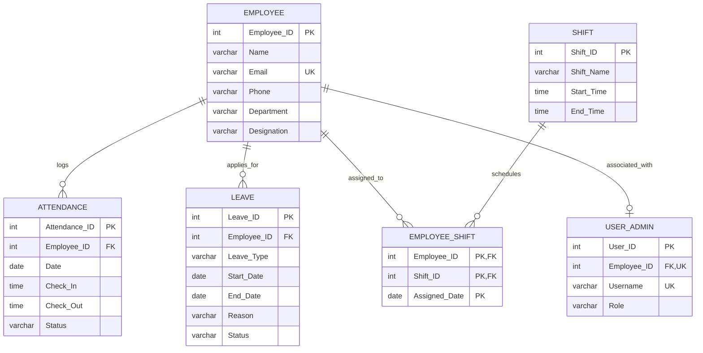

# Review 2: Conceptual & Logical Database Design

**Project Title:** EMPLOYEE ATTENDANCE, SHIFT, LEAVE MANAGEMENT SYSTEM  
**Student Name:** Maydhaansh Nanda  
**Roll Number:** 25WU0102155  
**Course:** Database Management Systems (DBMS)  

---

## 1. Overview
This directory contains the deliverables and design specifications for **Review 2** of the DBMS Course Project. In this stage, conceptual requirements identified in Review 1 are translated into formal **Entity-Relationship (ER) Models**, **Relational Schemas**, and **Normalization Standards** (1NF to 3NF/BCNF).

Included Artifact:
- `ER.png`: High-resolution Entity-Relationship diagram illustrating entities, attributes, primary/foreign keys, and cardinality ratios.

---

## 2. Entity-Relationship (ER) Architecture

---

## 3. Entity Specifications & Data Dictionary

### 1. `EMPLOYEE` (Master Personnel Entity)
Represents every individual registered within the organization.
- `Employee_ID` (`INT`, Primary Key): Unique alphanumeric/integer identifier.
- `Name` (`VARCHAR(100)`, NOT NULL): Full legal name of the employee.
- `Email` (`VARCHAR(100)`, UNIQUE): Institutional corporate contact address.
- `Phone` (`VARCHAR(15)`): Mobile contact number.
- `Department` (`VARCHAR(100)`): Functional organizational unit (e.g., IT, HR, Finance, Marketing, Operations).
- `Designation` (`VARCHAR(100)`): Professional title or hierarchy level.

### 2. `SHIFT` (Work Schedule Definition)
Defines operating windows for business activities.
- `Shift_ID` (`INT`, Primary Key): Identifier for the schedule.
- `Shift_Name` (`VARCHAR(50)`, NOT NULL): Label (e.g., Morning Shift, Standard Day Shift, Evening Shift, Night Shift).
- `Start_Time` (`TIME`, NOT NULL): Scheduled beginning timestamp.
- `End_Time` (`TIME`, NOT NULL): Scheduled conclusion timestamp.

### 3. `EMPLOYEE_SHIFT` (Schedule Assignment Junction Entity)
Resolves the many-to-many relationship between employees and operational shifts.
- `Employee_ID` (`INT`, FK referencing `EMPLOYEE.Employee_ID`)
- `Shift_ID` (`INT`, FK referencing `SHIFT.Shift_ID`)
- `Assigned_Date` (`DATE`): Date for which the shift assignment takes effect.
- **Composite Primary Key**: `(Employee_ID, Shift_ID, Assigned_Date)`

### 4. `ATTENDANCE` (Daily Workforce Logging Entity)
Captures check-in, check-out, and daily presence status.
- `Attendance_ID` (`INT`, Primary Key): Unique record identifier.
- `Employee_ID` (`INT`, FK referencing `EMPLOYEE.Employee_ID`): Individual logged.
- `Date` (`DATE`, NOT NULL): Calendar date of record.
- `Check_In` (`TIME`): Exact punch-in timestamp.
- `Check_Out` (`TIME`): Exact punch-out timestamp.
- `Status` (`VARCHAR(20)`): State classification (`Present`, `Late`, `Absent`, `On Leave`).
- **Composite Unique Key**: `UNIQUE (Employee_ID, Date)` prevents duplicate entries on the same day.

### 5. `LEAVE` (Leave Request & Entitlement Entity)
Tracks formal absence submissions and processing states.
- `Leave_ID` (`INT`, Primary Key): Unique leave tracking number.
- `Employee_ID` (`INT`, FK referencing `EMPLOYEE.Employee_ID`): Applicant.
- `Leave_Type` (`VARCHAR(50)`): Category (`Casual Leave`, `Sick Leave`, `Emergency Leave`, `Annual Leave`).
- `Start_Date` (`DATE`): Beginning date of absence.
- `End_Date` (`DATE`): Concluding date of absence.
- `Reason` (`VARCHAR(255)`): Stated explanation.
- `Status` (`VARCHAR(20)`): Approval state (`Pending`, `Approved`, `Rejected`).

### 6. `USER_ADMIN` (System Credentials & RBAC Entity)
Provides authentication mapping and role-based permissions.
- `User_ID` (`INT`, Primary Key): Unique account ID.
- `Employee_ID` (`INT`, UNIQUE, FK referencing `EMPLOYEE.Employee_ID`): Associated employee (Optional/Nullable for system superadmins).
- `Username` (`VARCHAR(50)`, UNIQUE, NOT NULL): System login credential.
- `Role` (`VARCHAR(20)`, NOT NULL): Authorization level (`Super Admin`, `HR Manager`, `System Auditor`, `Employee`).

---

## 4. Cardinality & Relationship Rationale

1. **`EMPLOYEE` to `ATTENDANCE` (1 : N)**:
   - One employee generates multiple historical daily attendance records over time.
   - An attendance record strictly belongs to exactly one employee.

2. **`EMPLOYEE` to `LEAVE` (1 : N)**:
   - An employee can submit zero or many leave requests throughout their tenure.
   - Each leave request is tied exclusively to one applicant employee.

3. **`EMPLOYEE` to `SHIFT` via `EMPLOYEE_SHIFT` (M : N)**:
   - An employee can rotate through different shifts over multiple dates.
   - A single shift schedule accommodates multiple employees simultaneously.
   - Modeled cleanly through associative entity `EMPLOYEE_SHIFT`.

4. **`EMPLOYEE` to `USER_ADMIN` (1 : 0..1)**:
   - An employee may have at most one associated system user account.
   - A system account corresponds to at most one employee.

---

## 5. Normalization & Integrity Enforcement

- **First Normal Form (1NF)**: All attributes contain atomic, non-divisible values. No repeating groups or multivalued attributes (e.g., shifts and leave requests are normalized into independent entities rather than arrays).
- **Second Normal Form (2NF)**: Meets 1NF, and all non-key attributes are fully functionally dependent on the entire primary key. In `EMPLOYEE_SHIFT`, `Assigned_Date` depends on the full composite key rather than any subset.
- **Third Normal Form (3NF)**: Meets 2NF, and contains zero transitive dependencies ($X \rightarrow Y \rightarrow Z$). Department and Designation attributes do not dictate personal contact attributes.
- **Referential Integrity Actions**:
  - Foreign keys enforce parent existence (`ON DELETE CASCADE` or `RESTRICT` depending on entity criticality).
  - Unique constraints enforce business logic (`UNIQUE (Employee_ID, Date)` in `ATTENDANCE`, `UNIQUE Email` in `EMPLOYEE`).
